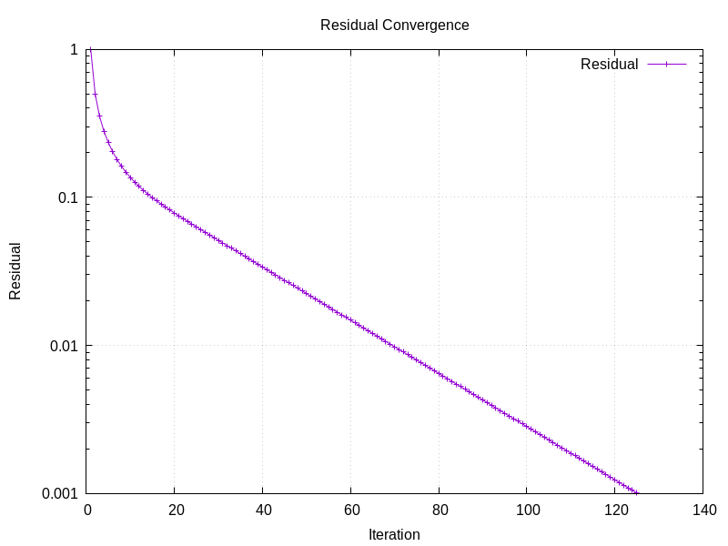
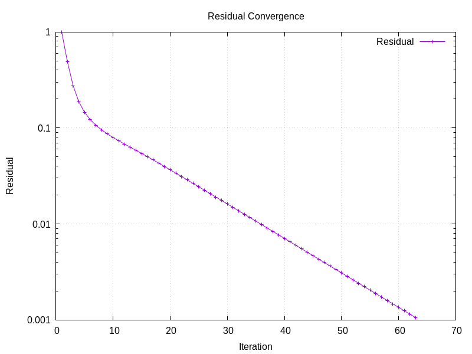

# Exercice 3 : Référence et utilisation de BLAS/LAPACK

## 1. En C, comment doit-on déclarer et allouer une matrice pour utiliser BLAS et LAPACK ?

Dans BLAS et LAPACK, les matrices sont stockées en mémoire sous la forme de tableaux 1D (linéaires) 
en utilisant le format Colonne-Major (Column-Major Order).

### Déclaration et allocation :
```c
int m = 3, n = 3; // Dimensions de la matrice (3x3 par exemple)
double *A = (double *)malloc(m * n * sizeof(double)); // Allocation dynamique d'une matrice 3x3
```
Une matrice 3x3 sera stocké dans la mémoire: [a11​,a21​,a31​,a12​,a22​,a32​,a13​,a23​,a33​]

```c
A[0] = 1.0; // a11
A[1] = 2.0; // a21
A[2] = 3.0; // a31
A[3] = 4.0; // a12
//et ainsi de suite...
free(A)//Libération de la mémoire
```

## Quelle est la signification de la constante LAPACK_COL_MAJOR ?
La constante LAPACK_COL_MAJOR est utilisée pour indiquer que les matrices sont stockées en ordre colonne-major (Column-Major Order),
le format natif de Fortran, le langage pour lequel BLAS/LAPACK a été conçu. Les éléments d'une matrice sont donc stockés colonne par
colonne, ce qui diffère du C, où le stockage est fait ligne par ligne.


## 3. À quoi correspond la dimension principale (leading dimension) généralement notée ld ?

La leading dimension correspond au nombre d'éléments entre deux élements consécutifs de la même
colonn dans la mémoire. Avec la constante LAPACK_COL_MAJOR, la leading dimension correspond au nombre de lignes
de la matrice. La leading dimesnion est donc nécéssaire dans l'appel d'une fonction LAPACK ou BLAS pour assurer un 
accès correct aux données.

## 4. Que fait la fonction dgbmv ? Quelle méthode implémente t-elle ?
La fonction dgbmv effectue la multiplication d'une matrice stockée sous forme de bandes
par un vecteur. Elle implémente le produit matrice-vecteur.

## 5. Que fait la fonction dgbtrf ? Quelle méthode implémente t-elle ?
La fonction dgbtrf réalise la factorisation LU d'une matrice stockée sous forme de bandes.
Elle implémente la factorisation LU et peut donc résoudre des systèmes linéaires ou calculer le determinant d'une matrice

## 6. Que fait la fonction dgbtrs ? Quelle méthode implémente t-elle ?
La fonction dgbtrs résout un système linéaire avec une matrice stockée sous forme de bandes en utilisant
le résulatat de la factorisation LU effectué par dgbtrf. Elle implémente la méthode de substitution arrière
après la factorisation LU.

## 7. Que fait la fonction dgbsv ? Quelle méthode implémente t-elle ?
La fonction dgbsv résout un système linéaire avec une matrice stockée sous forme de bandes en faisant 
la factorisation LU et la substitution arrière en une étape. Elle implémente la méthode de factorisation LU avec 
substitution arrière.

## 8. Comment calculer la norme du résidu relatif avec des appels BLAS ?

On peut utiliser la fonction dnrm2 pour calculer la norme euclidienne d'un vecteur. On peut l'appliquer au vecteur du résidu après avoir
effectué une opération matrice-vecteur avec dgbmv et obtenu la solution du système linéaire.


---

## Fonctions clés

### **1. `set_GB_operator_colMajor_poisson1D`**
**Description générale :**  
Cette fonction initialise une matrice creuse en stockage bande (banded storage) pour représenter l'opérateur de Poisson 1D en utilisant le format **Column-Major Order**. Elle est utilisée pour la discrétisation des dérivées secondes avec des conditions de Dirichlet.

**Détails de l'implémentation :**
- La matrice résultante est stockée avec \( k_v + 1 + k_u \) lignes, où \( k_v \) représente les zéros en dessous de la diagonale principale et \( k_u \) ceux au-dessus.
- Les entrées de la diagonale principale sont initialisées à 2, tandis que celles des diagonales supérieures et inférieures sont à -1.
- Des zéros sont ajoutés pour s'assurer que la matrice respecte le format bande.
  
**Code clé :**
```c
for (j = 0; j < *la; j++) {
    k = j * (*lab);
    if (*kv >= 0) {
        for (i = 0; i < *kv; i++) {
            AB[k + i] = 0.0; // Remplissage de zéros en-dessous
        }
    }
    AB[k + *kv] = -1.0;   // Diagonale inférieure
    AB[k + *kv + 1] = 2.0; // Diagonale principale
    AB[k + *kv + 2] = -1.0; // Diagonale supérieure
}
```

**Utilisation principale :**
Cette fonction est essentielle pour préparer la matrice opératrice avant de résoudre l'équation de Poisson 1D.

---

### **2. `set_dense_RHS_DBC_1D`**
**Description générale :**  
Cette fonction initialise le vecteur du second membre (\( \text{Right-Hand Side} \), RHS) en intégrant les conditions aux limites de Dirichlet (\( BC_0 \) et \( BC_1 \)).

**Détails de l'implémentation :**
- Les deux premières et dernières entrées du vecteur sont assignées aux valeurs des conditions aux limites.
- Les autres éléments intermédiaires sont initialisés à zéro, indiquant l'absence de source.

**Code clé :**
```c
RHS[0] = *BC0;           // Condition au bord gauche
RHS[*la - 1] = *BC1;     // Condition au bord droit
for (int i = 1; i < (*la) - 1; i++) {
    RHS[i] = 0.0;        // Initialisation des points internes
}
```

**Utilisation principale :**
Cette fonction configure le vecteur source pour résoudre l'équation en fonction des contraintes imposées aux limites.

---

### **3. `eigmax_poisson1D` et `eigmin_poisson1D`**
**Description générale :**  
Ces deux fonctions calculent respectivement la valeur propre maximale et minimale de la matrice opératrice de Poisson 1D. Ces valeurs sont cruciales pour déterminer le paramètre optimal \( \alpha \) pour la méthode de Richardson.

**Détails de l'implémentation :**
- Les valeurs propres de la matrice de Poisson 1D sont obtenues analytiquement, grâce à sa structure tridiagonale régulière :
  \[
  \lambda_k = 2 - 2 \cos\left(\frac{k \pi}{n + 1}\right)
  \]
  - \( \text{eigmax\_poisson1D} \) utilise \( k = n \).
  - \( \text{eigmin\_poisson1D} \) utilise \( k = 1 \).

**Code clé :**
```c
double eigmax_poisson1D(int *la) {
    return -2.0 * cos((*la) * M_PI / (*la + 1)) + 2.0;
}

double eigmin_poisson1D(int *la) {
    return -2.0 * cos(M_PI / (*la + 1)) + 2.0;
}
```

**Utilisation principale :**
Ces fonctions sont appelées par `richardson_alpha_opt` pour calculer le \( \alpha \) optimal, réduisant ainsi le temps de convergence.

---

### **4. `relative_forward_error`**
**Description générale :**  
Cette fonction évalue la précision d'une solution numérique en comparant son écart relatif à une solution analytique donnée.

**Détails de l'implémentation :**
- L'erreur relative est calculée en utilisant la norme \( L_2 \), normalisée par la norme \( L_2 \) de la solution exacte :
  \[
  \text{erreur} = \frac{\|x - y\|_2}{\|x\|_2}
  \]
  où \( x \) est la solution exacte et \( y \) la solution numérique.

**Code clé :**
```c
for (int i = 0; i < *la; i++) {
    err += pow((x[i] - y[i]), 2); // Différence au carré
    norm_x += pow(x[i], 2);       // Norme de la solution exacte
}
return sqrt(err) / sqrt(norm_x);  // Ratio des normes
```

**Utilisation principale :**
Cette fonction est idéale pour mesurer la précision et la stabilité des méthodes numériques utilisées.

---

### **5. `richardson_alpha`**
**Description générale :**  
Implémente la méthode de Richardson avec un paramètre \( \alpha \) fixé pour résoudre un système linéaire. Cette méthode itérative est souvent utilisée pour les matrices creuses comme celle générée pour le problème de Poisson.

**Détails de l'implémentation :**
- À chaque itération :
  1. Le résidu \( r_k = b - Ax_k \) est calculé.
  2. Le vecteur solution est mis à jour : \( x_{k+1} = x_k + \alpha r_k \).
- La convergence est suivie en calculant la norme relative du résidu à chaque étape.

**Code clé :**
```c
cblas_dgbmv(CblasColMajor, CblasNoTrans, *la, *la, *kl, *ku, -1.0, AB, *lab, X, 1, 1.0, b, 1);
resvec[0] = cblas_dnrm2(*la, b, 1) / norm_b;

while (resvec[*nbite] > *tol && *nbite < *maxit) {
    cblas_daxpy(*la, *alpha_rich, b, 1, X, 1);
    (*nbite)++;
}
```

**Utilisation principale :**
Cette fonction est une méthode de base pour résoudre des systèmes linéaires. Elle peut être modifiée pour inclure des techniques de préconditionnement.

---
### **6. `richardson_MB`**
**Description générale :**  
La fonction implémente la méthode de Richardson avec préconditionnement pour résoudre un système linéaire \( AX = B \). La matrice de préconditionnement \( M_B \) est utilisée pour améliorer la convergence. Cette méthode est particulièrement adaptée aux matrices creuses comme celles générées pour le problème de Poisson.

**Détails de l'implémentation :**
- **Prétraitement :**  
  1. La matrice \( M_B \) est factorisée en \( LU \) à l'aide de `dgbtrf`.
  2. Un vecteur résidu \( r_k \) est initialisé.
- **Boucle itérative :**  
  1. Le résidu \( r_k = b - Ax_k \) est calculé.
  2. \( M_B r_k = r_k \) est résolu à l'aide de `dgbtrs`.
  3. La solution est mise à jour : \( x_{k+1} = x_k + r_k \).
  4. La norme relative du résidu est calculée et enregistrée dans `resvec`.
- **Critères d'arrêt :**  
  La boucle s'arrête si la norme relative du résidu devient inférieure à la tolérance ou si le nombre maximal d'itérations est atteint.

**Code clé :**
```c
dgbtrf_(la, la, kl, &kuu, MB, lab, ipiv, &info);
cblas_dgbmv(CblasColMajor, CblasNoTrans, *la, *la, *kl, *ku, -1.0, AB, *lab, X, 1, 1.0, rk, 1);
dgbtrs_("N", la, kl, &kuu, &NHRS, MB, lab, ipiv, rk, la, &info, 1);
cblas_daxpy(*la, 1.0, rk, 1, X, 1);
```

**Utilisation principale :**  
La méthode de Richardson avec préconditionnement est idéale pour résoudre des systèmes linéaires issus de matrices diagonales dominantes. Elle est plus rapide que la méthode de Richardson standard dans ces cas. 

---

### Complexité algorithmique, en espace, et qualité numérique

| **Fonction**                        | **Complexité temporelle** | **Complexité en espace** | **Qualité numérique** | **Commentaire**                                                                                           |
|-------------------------------------|---------------------------|---------------------------|------------------------|-----------------------------------------------------------------------------------------------------------|
| `set_GB_operator_colMajor_poisson1D` | \( O(la) \)               | \( O(la \cdot kv) \)      | Bonne                 | Allocation pour stocker une matrice en bande (\( kv \) dépend de la largeur de bande, souvent constante). |
| `set_GB_operator_colMajor_poisson1D_Id` | \( O(la) \)            | \( O(la \cdot kv) \)      | Bonne                 | Similaire à la fonction précédente, qualité numérique robuste car il n'y a pas de calcul sensible.        |
| `set_dense_RHS_DBC_1D`              | \( O(la) \)               | \( O(la) \)               | Bonne                 | Gère les conditions aux bords avec des initialisations simples, donc stable.                             |
| `set_analytical_solution_DBC_1D`    | \( O(la) \)               | \( O(la) \)               | Bonne                 | Stable, mais dépend de la précision des valeurs initiales pour les conditions aux bords.                  |
| `set_grid_points_1D`                | \( O(la) \)               | \( O(la) \)               | Bonne                 | Crée une grille uniforme, très stable numériquement.                                                      |
| `relative_forward_error`            | \( O(la) \)               | \( O(1) \)                | Dépendante            | Calcul des erreurs sensibles aux petites perturbations dans les données, dépend de la précision des données. |
| `indexABCol`                        | \( O(1) \)                | \( O(1) \)                | Bonne                 | Simple calcul d'indice, insensible aux erreurs numériques.                                                 |
| `dgbtrftridiag`                     | \( O(1) \)                | \( O(1) \)                | N/A                   | Fonction placeholder sans calcul réel.                                                                    |
| `eig_poisson1D`                     | \( O(1) \)                | \( O(1) \)                | Bonne                 | Calcule un scalaire en combinant des fonctions stables.                                                   |
| `eigmax_poisson1D`                  | \( O(1) \)                | \( O(1) \)                | Bonne                 | Qualité robuste car les calculs sont basés sur des opérations mathématiques simples.                       |
| `eigmin_poisson1D`                  | \( O(1) \)                | \( O(1) \)                | Bonne                 | Idem que pour `eigmax_poisson1D`.                                                                         |
| `richardson_alpha_opt`              | \( O(1) \)                | \( O(1) \)                | Bonne                 | Aucun problème de stabilité vu la simplicité des calculs.                                                 |
| `richardson_alpha`                  | \( O(k \cdot la) \)       | \( O(la) \)               | Moyenne à Bonne       | Qualité dépendante du choix de \( \alpha \) et de la convergence des itérations.                          |
| `richardson_MB`                     | \( O(k \cdot la) \)       | \( O(la) \)               | Moyenne à Bonne       | Sensible aux erreurs d'approximation dues à la matrice de bande modifiée.                                  |
| `extract_MB_jacobi_tridiag`         | \( O(la) \)               | \( O(la) \)               | Bonne                 | Robuste car il s'agit d'une extraction directe sans calcul complexe.                                       |
| `extract_MB_gauss_seidel`           | \( O(la) \)               | \( O(la) \)               | Bonne                 | Idem que pour `extract_MB_jacobi_tridiag`, très stable.                                                   |
| `set_CSR_poisson1D`                 | \( O(N) \)                | \( O(3N - 2) \)           | Bonne                 | Génération efficace d'une matrice creuse au format CSR, sans risque significatif d'erreurs numériques.     |
| `set_CSC_poisson1D`                 | \( O(N) \)                | \( O(3N - 2) \)           | Bonne                 | Génération efficace d'une matrice creuse au format CSC, également stable numériquement.                   |
| `dcsrmv`                            | \( O(N) \)                | \( O(N) \)                | Bonne                 | Produit matrice-vecteur au format CSR, stable numériquement grâce à des opérations simples.                |
| `dcscmv`                            | \( O(N) \)                | \( O(N) \)                | Bonne                 | Produit matrice-vecteur au format CSC, stable numériquement et efficace pour les matrices creuses.         |


---

### Justifications des choix

1. **Complexité temporelle**:
   - Les fonctions qui parcourent une grille ou une matrice ont \( O(la) \).
   - Les fonctions de calcul élémentaire (comme des opérations scalaires) ont \( O(1) \).
   - Les méthodes directes de la bibliotheques lapacke ont \( O(n^3) \)
   - Méthodes itératives : \( O(k \cdot n) \) où \( k \) est le nombre d'itérations.
   - Les fonctions itératives dépendent du nombre d'itérations \( k \), d'où \( O(k \cdot la) \).
   - `dcsrmv` et `dcscmv` réalisent des produits matrice-vecteur, chaque entrée non nulle de la matrice étant multipliée et accumulée, d'où \( O(N) \).

2. **Complexité en espace**:
   - Les fonctions allouant de la mémoire pour des matrices (par exemple, stockées en bande ou dense) ont une complexité \( O(la) \) ou \( O(la \cdot kv) \).
   - Les fonctions qui n'allouent pas de grandes structures (comme `indexABCol`) ont \( O(1) \).
   - Les formats CSR et CSC stockent uniquement les valeurs non nulles (\( 3N - 2 \) pour une matrice de Poisson 1D), avec des indices supplémentaires.

3. **Qualité numérique**:
   - Les fonctions de configuration de matrices ou vecteurs (e.g., `set_` fonctions) sont stables, car elles manipulent des données déterministes.
   - Les calculs itératifs (comme `richardson_alpha`) sont sensibles aux erreurs d'arrondi et aux mauvais choix de paramètres (\( \alpha \)).
   - Les erreurs relatives (`relative_forward_error`) dépendent de la précision des données et de l'échelle des erreurs, donc leur qualité peut varier.


---

## Résultats et Convergence

### Graphes de convergence

Les images suivantes montrent la convergence des méthodes en fonction des itérations :

#### Méthode de Richardson (alpha)


- ~30 cycles cpu avec les paramètres par défaut

#### Méthode de Jacobi


- ~100 cyles cpu avec les paramètres par défaut

#### Méthode de Gauss-Seidel


- ~80 cycles cpu avec les paramètres par défaut
---

### Comparaison des méthodes utilisées

Trois méthodes itératives ont été utilisées :
- **Richardson (alpha)** : Méthode simple basée sur un paramètre optimal.
- **Jacobi** : Méthode basée sur une matrice diagonale préconditionnée.
- **Gauss-Seidel** : Méthode basée sur une précondition \( (D-E) \), converge plus rapidement que Jacobi pour les matrices diagonales dominantes.


### Méthodes directes et itératives

| **Méthode**        | **Avantages**                                                                 | **Inconvénients**                                                                                         |
|---------------------|------------------------------------------------------------------------------|----------------------------------------------------------------------------------------------------------|
| Méthodes Directes  | - Précision élevée<br>- Convient pour les matrices denses<br>- Résolution exacte | - Complexité temporelle élevée \(O(n^3)\)<br>- Consomme beaucoup de mémoire                                                                   |
| Méthodes Itératives | - Scalabilité pour les matrices creuses<br>- Complexité temporelle \(O(k \cdot n)\) | - Convergence dépendante de la condition de la matrice<br>- Sensibles aux erreurs d'arrondi pour certaines configurations |


## Conclusion

1. Les méthodes itératives comme Jacobi et Gauss-Seidel sont bien adaptées aux grandes matrices creuses.
2. Gauss-Seidel est généralement plus performant que Jacobi en termes de convergence.
3. La méthode de Richardson peut être utilisée comme point de départ pour comprendre les méthodes itératives.


